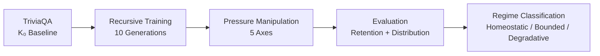

<p align="center">
  <h1 align="center">LLM Knowledge Collapse Experiments</h1>
  <p align="center">
    Experimental code and data for reproducing the results in<br>
    <strong>Effective Training Pressure Gates Recursive Knowledge Degradation in LLMs:<br>A Multi-Axis Dose-Response Study</strong>
  </p>
</p>

<p align="center">
  <a href="https://www.python.org/"></a>
  <a href="https://pytorch.org/"></a>
  <a href="https://huggingface.co/docs/transformers"></a>
  <a href="https://huggingface.co/docs/peft"></a>
  <a href="LICENSE"></a>
</p>

---

## Overview

We investigate how recursive fine-tuning on synthetic data progressively degrades factual knowledge in LLMs, and under what conditions this degradation can be bounded or reversed.

Through systematic dose-response experiments spanning **3 backbones**, **10 recursive generations**, and **3-5 independent seeds** per condition, we characterize a sharp regime transition governed by *effective training pressure* — a multidimensional quantity jointly determined by adapter rank, learning rate, and synthetic exposure.

## Key Findings

| # | Finding | Evidence |
|---|---------|----------|
| 1 | Sharp regime transition from homeostatic (>90%) to degradative | Rank sweep across backbones |
| 2 | Threshold differs ~10× across architectures (Gemma: rank 3–6, Qwen: rank 50–88) | Cross-backbone comparison |
| 3 | Rank × LR interaction: both axes jointly determine regime | 9-cell matrix experiment |
| 4 | Retention/distribution dissociation at intermediate pressure | Efficiency analysis |
| 5 | 5% exposure reduction restores homeostasis at boundary | Intervention experiment |

## Experimental Pipeline



**Axes of variation:**
- Adapter rank (r = 2, 4, 16, 32, 64, 128, 256)
- Learning rate (1e-6, 5e-6, 1e-5, 2e-5)
- Method (QLoRA vs Full Fine-Tuning)
- Module topology (q+v vs all-linear)
- Synthetic exposure (95%, 100%)

## Results Summary

### Qwen 2.5 1.5B — Rank Dose-Response (10 Generations, 3 Seeds)

| Rank | Gen10 Retention (%) | Regime |
|:----:|:-------------------:|:------:|
| 4    | **97.4 ± 0.0** | Homeostatic |
| 16   | **97.4 ± 0.6** | Homeostatic |
| 64   | 87.1 ± 1.3 | Bounded |
| 128  | 80.9 ± 2.1 | Degradative |
| 256  | 76.8 ± 1.8 | Degradative |

### FFT vs QLoRA (LR = 1e-6, 3 Seeds)

| Method | Gen10 Retention (%) |
|:------:|:-------------------:|
| QLoRA r=16 | **97.4 ± 0.0** |
| FFT | 91.9 ± 0.6 |

## Hardware

All experiments were run on a single **NVIDIA RTX 4000 Ada (20GB)** via SSH.

Approximate runtimes:
- Single 10-generation run (Qwen, QLoRA): ~1.5 hours
- Single 10-generation run (Gemma 3, QLoRA): ~3 hours
- Full experimental grid: ~5 days

## Installation

```bash
git clone https://github.com/Jazancort/llm-knowledge-collapse-experiments.git
cd llm-knowledge-collapse-experiments

# Requires uv (https://docs.astral.sh/uv/)
uv sync
```

**Requirements:** Python 3.10–3.12, CUDA 12.4+, ~20GB GPU VRAM.

## Reproducing Experiments

### Core experiments (Qwen, 10 generations)

```bash
# Single configuration
uv run python scripts/fft_drift_gen10.py --method qlora --rank 16 --seed 15

# FFT comparison
uv run python scripts/fft_drift_gen10.py --method fft --lr 1e-6 --seed 15

# Rank × LR matrix
uv run python scripts/exp_rank_lr_matrix.py
```

### Cross-backbone (Gemma 3, Gemma 4)

```bash
# Gemma 3 — rank sweep
uv run python scripts/run_v3_experiments.py --backbone gemma3 --rank 4 --seeds 15,137,256,42,77

# Gemma 4
uv run python scripts/run_v3_experiments.py --backbone gemma4 --rank 16 --seed 15
```

### Generating figures

```bash
# All paper figures
uv run python scripts/plot_fig4_mean_std.py          # Fig 4: FFT vs QLoRA
uv run python scripts/gen_fig_combined_trajectories_v3.py  # Fig 1: Trajectories
uv run python scripts/gen_fig_cross_backbone_v3.py   # Fig 3: Cross-backbone
uv run python scripts/gen_fig_interventions_v3.py    # Fig 6: Interventions
```

## Project Structure

```
llm-knowledge-collapse-experiments/
├── scripts/
│   ├── fft_drift_gen10.py          # Main 10-gen experiment runner
│   ├── fft_vs_qlora.py             # FFT vs QLoRA comparison
│   ├── run_v3_experiments.py       # v3 multi-backbone runner
│   ├── exp_rank_lr_matrix.py       # Rank × LR interaction
│   ├── causal_intervention.py      # Exposure reduction experiment
│   ├── plot_fig4_mean_std.py       # Figure generation scripts
│   └── gen_fig_*.py                # Other figure scripts
├── outputs/
│   ├── fft_drift_gen10/            # 10-gen results (3 seeds × 2 methods)
│   ├── v3_gemma3_*/               # Gemma 3 cross-backbone
│   ├── v3_gemma4_*/               # Gemma 4 cross-backbone
│   ├── rank_lr_matrix/            # Interaction experiment
│   └── causal_intervention/       # Exposure intervention
├── src/                            # Shared utilities
├── configs/                        # Hyperparameter configs
├── pyproject.toml                  # Dependencies (uv)
├── requirements.txt                # Fallback pip requirements
└── README.md
```

## Citation

```bibtex
@article{azancort2025effective,
  title={Effective Training Pressure Gates Recursive Knowledge Degradation 
         in LLMs: A Multi-Axis Dose-Response Study},
  author={Azancort Neto, Julio Leite and Teixeira, Carlos Andr{\'e} de Mattos 
          and Ferreira de Carvalho, Andr{\'e} Carlos Ponce de Leon 
          and Franc{\^e}s, Carlos Renato Lisboa},
  year={2025}
}
```

## License

MIT
